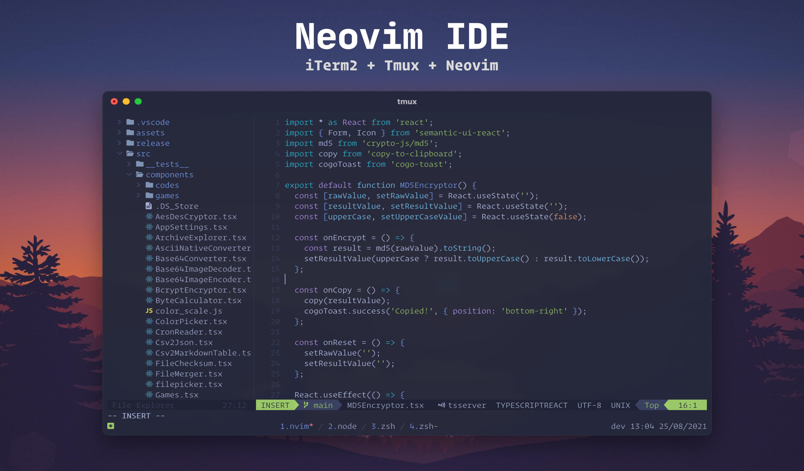

# Dev Tricks
Some stuff from my daily development(such as dotfiles,scripts,snippets, articles...:)

## My Development Environment

I have been using VS Code for a few years, 
but now I want to experience using neovim as my first choice IDE,
I hope I can stick to it.

### Neovim



- Neovim >= 0.5.0
- Tmux >= 3.2a
- iTerm2
- Theme: [tokyonight.nvim](https://github.com/folke/tokyonight.nvim)
- Font: [Nerd Font](https://www.nerdfonts.com)

Neovim plugins:
- [Packer](https://github.com/wbthomason/packer.nvim)
- [TreeSitter](https://github.com/nvim-treesitter/nvim-treesitter)
- [LSP(built-in)](https://neovim.io/doc/user/lsp.html)
- [LspConfig](https://github.com/neovim/nvim-lspconfig)
- [Telescope](https://github.com/nvim-telescope/telescope.nvim)
- [NvimTree](https://github.com/kyazdani42/nvim-tree.lua)
- [NvimCompe](https://github.com/hrsh7th/nvim-compe)
- [NvimDap](https://github.com/mfussenegger/nvim-dap)
- [GitSigns](https://github.com/lewis6991/gitsigns.nvim)
- [WhichKey](https://github.com/liuchengxu/vim-which-key)
- [Neogit](https://github.com/TimUntersberger/neogit)
- [Neoterm](https://github.com/kassio/neoterm)
- [Lualine](https://github.com/hoob3rt/lualine.nvim)
- [Vimwiki](https://github.com/vimwiki/vimwiki)
- [Neoformat](https://github.com/sbdchd/neoformat)
- [Autopairs](https://github.com/windwp/nvim-autopairs)
- [LuaSnip](https://github.com/L3MON4D3/LuaSnip)
- [Colorizer](https://github.com/norcalli/nvim-colorizer.lua)
- [TsRainbow](https://github.com/p00f/nvim-ts-rainbow)
- [ToDoComment](https://github.com/folke/todo-comments.nvim)
- ...

### ZSH plugins
- [zsh-autosuggestions](https://github.com/zsh-users/zsh-autosuggestions)
- [zsh-syntax-highlighting Build Status](https://github.com/zsh-users/zsh-syntax-highlighting)

## Useful tricks
### Java

#### Install a jar in your local maven repository
```bash
mvn install:install-file -Dfile=./demo.jar \
    -DgroupId=com.example -DartifactId=demo -Dversion=0.1.0 -Dpackaging=jar
```

#### Run Spring Boot application with JVM arguments
```bash
mvn spring-boot:run  -Dspring-boot.run.jvmArguments="-Xms1024m -Xmx512m"
```

#### JDK8 support in VSCode
settings.json

```json
// --snip--
"java.home": "/path/to/jdk-11",
"java.configuration.runtimes": [
  {
    "name": "JavaSE-1.8",
    "path": "/path/to/jdk-8",
    "default": true
  },
  {
    "name": "JavaSE-11",
    "path": "/path/to/jdk-11",
  },
]
// --snip--

```

### Rust

#### Install Diesel CLI with PostgreSQL and MySQL drivers support
```bash
RUSTFLAGS='-L /usr/local/opt/libpq/lib -L/usr/local/opt/mysql-client/lib' cargo install diesel_cli
```

#### To show the stdout in test output
```bash
cargo test -- --nocapture
```

### Web

#### Check and upgrade dependencies to the newer versions
```bash
npm install -g npm-check-updates
npm-check-updates -u
npm install
```

### MAC OS

#### Install Command Line Tools 
```bash
xcode-select --install
```

#### Delete ".DS_Store" files
```bash
find . -name '.DS_Store' -type f  -print -delete
```

#### Reset Dock and Launchpad
```bash
defaults write com.apple.dock ResetLaunchPad -bool true && killall Dock
```

#### Some keyboard shortcuts in Terminal.app

- [⌃+a] Move the cursor to the start of line
- [⌃+e] Move the cursor to the end of line 
- [⌃+l] Clear screen
- [⌃+u] Clear the line
- [⌃+k] Clear the line that appears after the cursor
- [⌥+←] or [⌥+→] Move the cursor word by word

#### Clear the commands history in shells
1. BASH
```shell
history -c
```

2. ZSH
```shell
history -p
```
